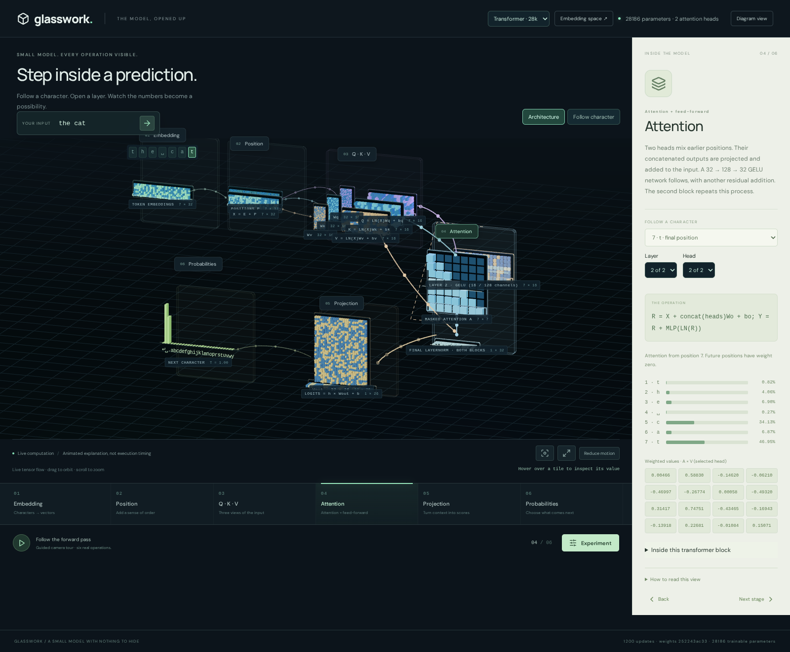
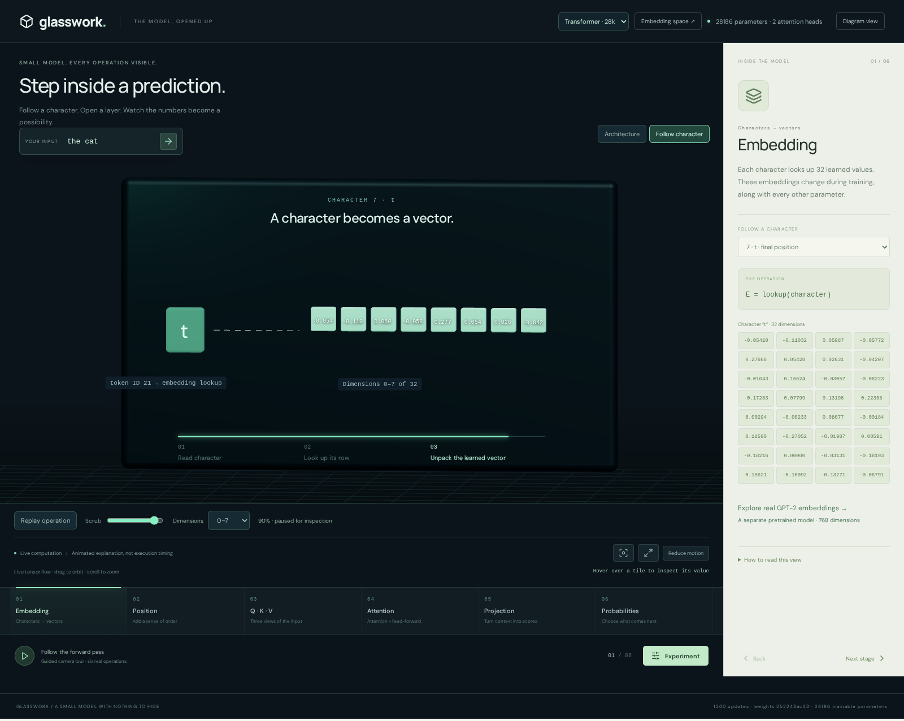
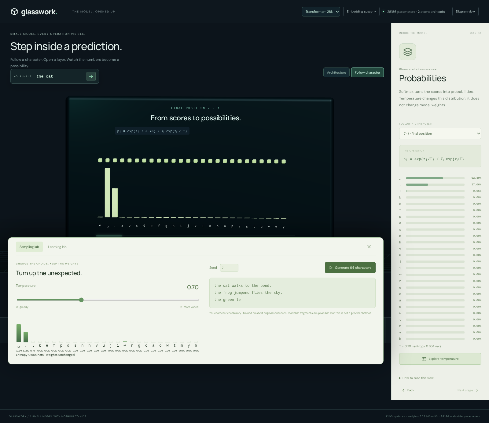
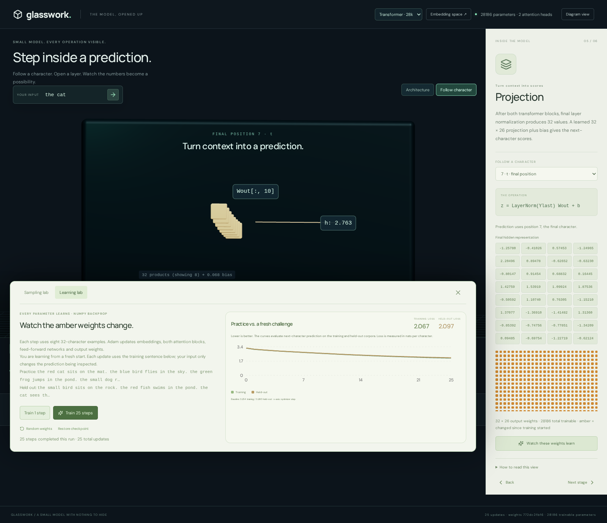
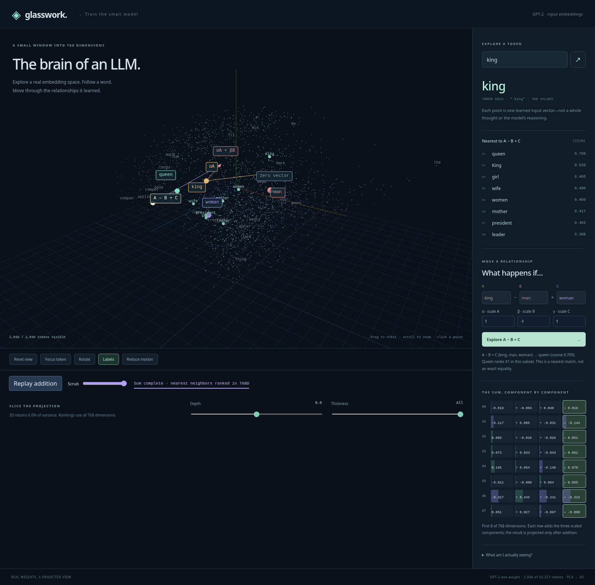
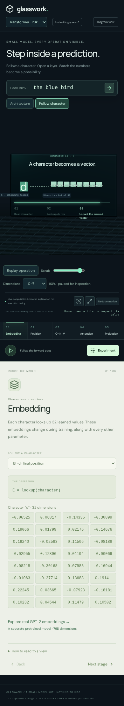

# Glasswork

**Step inside a prediction.** Watch a character become a vector, follow attention through a small transformer, train its weights, and explore the real embedding space of GPT-2.

Built with **NumPy math and manual backpropagation**, React, Three.js, and FastAPI. No PyTorch, TensorFlow, or model-training framework.



## Follow a character

Switch between the architecture overview and an animated close-up. Replay or scrub through embedding lookup, position addition, Q/K/V projections, attention, output scores, and probabilities. Choose either transformer layer and attention head; inspect the actual values, residual additions, and feed-forward activations.



The larger model has 32 embedding dimensions. The close-up shows eight at a time, with a dimension selector. Motion explains operations; it is not a recording of execution time. The six lesson stages group the real operations, rather than pretending the transformer has only six individual layers.

## Experiment with a real model

The **28,186-parameter transformer** is selected by default. Its trained checkpoint generates short, often readable fragments from a deliberately narrow corpus of original sentences. It still makes mistakes and is not a general chatbot.

| | Transformer | Original team model |
|---|---|---|
| Stored parameters | 28,186 | 640 |
| Trainable parameters | All 28,186 | 40 output weights |
| Character vocabulary | 26 | 10 |
| Context window | 32 characters | 128 characters |
| Embedding width | 32 | 4 |
| Architecture | 2 blocks, 2 heads per block, 128-wide GELU feed-forward | 1 attention head |
| Optimizer | Adam, manual gradients | SGD, output projection only |

The sampling lab shows the probability distribution beside temperature and seeded generation controls. The learning lab can start from random weights, perform one or 25 updates, stop between updates, and restore the checkpoint. The loss curves use separate training and held-out text. Both model sessions stay available when switching models.





## The brain of an LLM

The connected embedding explorer displays **2,048 real GPT-2 input vectors**, projected from 768 dimensions into 3D. Search tokens, reveal neighbors, slice the space, and animate vector addition with scalar coefficients:

```text
αA + βB + γC
king − man + woman
```

Arrows build the sum head to tail. The component view shows eight of the original 768 coordinates. Nearest neighbors are computed in the full vector space, not from screen distance. PCA is centered, so addition starts at the **projected zero vector**, which can differ from the plot origin. The nearest match is not an exact mathematical equality.



The GPT-2 vectors are a separate pretrained dataset; the little transformer does not train or generate them. Navigation between the explorers preserves the lab model, prompt, and temperature.

## Run locally

Requires **Python 3.12+** and **Node 22.12+**.

```bash
git clone https://github.com/Ghaz-555/Hackathon.git
cd Hackathon
python3 -m venv .venv
.venv/bin/pip install -r requirements-web.txt
npm --prefix frontend ci
npm --prefix frontend run build
.venv/bin/python scripts/serve.py
```

Open **http://127.0.0.1:8001** for the model explorer or **http://127.0.0.1:8001/brain.html** for embeddings. No API key or model download is needed; both checkpoints and the GPT-2 subset are included. If the port is occupied, use `--port 8002`.

For development, keep the API on port 8001 and run `npm --prefix frontend run dev`. Restart the Python server after backend changes, and rebuild the frontend before using the production server.

## Hosting

The full application is **not static**: training, generation, and learner sessions run in Python. The simplest deployment serves the frontend and API together on a Python-capable host.

[GitHub Pages hosts static HTML, CSS and JavaScript](https://docs.github.com/en/pages/getting-started-with-github-pages/what-is-github-pages). The embedding explorer computes in the browser and can be deployed statically. Hosting this whole frontend on Pages would additionally require configuring its repository base path, a separate backend API URL, and that backend's allowed origins. The current build uses same-origin `/api` and root-relative asset paths; it is not an out-of-the-box Pages deployment.

<details>
<summary>View the mobile layout</summary>



</details>

## Architecture

```text
Browser
├── React + React Three Fiber: model explorer, animated operations, experiments
└── Three.js: GPT-2 embedding explorer and full-dimensional vector arithmetic
         │
         └── FastAPI session API
             ├── TransformerEngine → existing manually differentiated NumPy transformer
             └── TeamEngine → adapted original team attention engine
```

- `frontend/src/OperationJourney.tsx`: animated operation close-ups.
- `frontend/src/ExplorerScene.tsx`: interactive tensor architecture.
- `frontend/src/brain/`: embedding math, animation, search, and slicing.
- `server/`: isolated model sessions and adapters for both engines.
- `glasswork/model.py`, `glasswork/training.py`: transformer math, backpropagation, and Adam.
- `backend/`: preserved original team source.
- `data/`: original training and held-out sentences.
- `artifacts/`: checkpoints, numerical reports, and verification evidence.

## Verification

```bash
.venv/bin/python -m unittest discover -s tests -v
npm --prefix frontend test
npm --prefix frontend run build
```

Browser tests require Playwright with Chromium and a running production server:

```bash
GLASSWORK_URL=http://127.0.0.1:8001 python scripts/test_browser.py
GLASSWORK_URL=http://127.0.0.1:8001 python scripts/test_integrated_browser.py
GLASSWORK_URL=http://127.0.0.1:8001 python scripts/test_expanded_browser.py
```

The expanded browser test also captures the README screenshots from the running app. It exercises animation, scrubbing, both models, learning, generation, session recovery, cross-page navigation, vector arithmetic, mobile layouts, reduced motion, and WebGL fallback. Reports are stored under `artifacts/`.

## Provenance

The original team engine remains under its MIT license. The existing 28k NumPy transformer and trained checkpoint are now connected to the web lab. Integration, visualization, additional validation, and UI work were developed with AI coding assistance. The architecture explorer takes visual inspiration from [Brendan Bycroft's LLM visualization](https://bbycroft.net/llm); its code is not copied. GPT-2's pinned model revision and license accompany the embedding export.

See [expanded integration notes](docs/EXPANDED_MAIN2.md), [the earlier integration record](docs/MAIN2_INTEGRATION.md), and [historical project notes](docs/history/).
